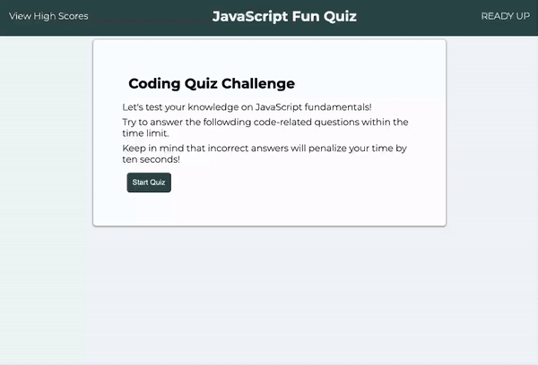
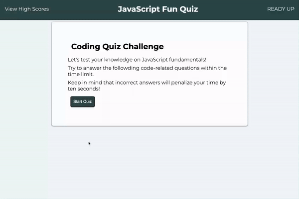
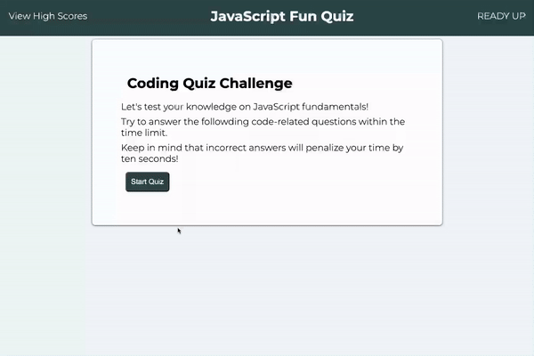
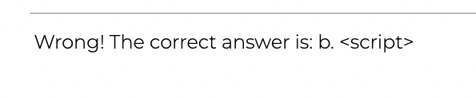
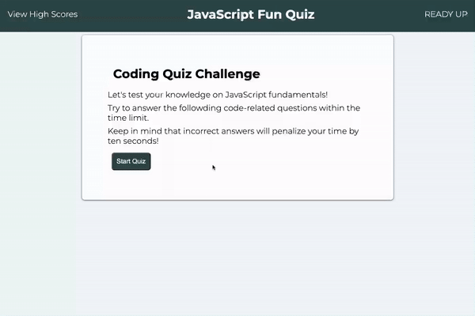
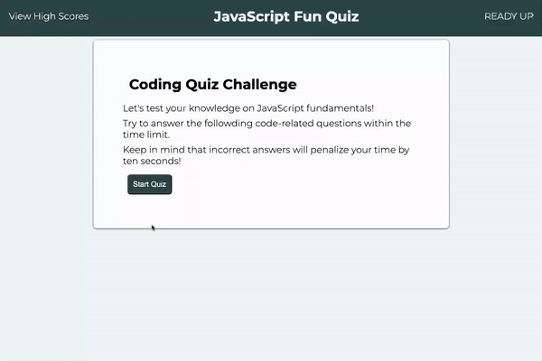
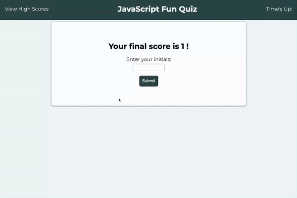

# Timed Code Quiz

This is an interactive, timed quiz that stores user initials and scores in a local storage. This app is developed from scratch utilizing the power of JavaScript.

## Accessing the Application
To access the application, you can follow the deployment link or download the source files in the GitHub repository linked below.

<strong>Deployment Link:</strong> <a href="#">Timed Code Quiz</a>

<strong>GitHub:</strong> <a href="https://github.com/itsDenMat/timed_code_quiz">GitHub Timed Code Quiz Repository</a>

## Timed Code Quiz Functionality
* User will be presented with a questions and selection of answers when START button is pressed.

* A timer, counting down, will be present once the application is started.

* User will be presented with a new question when a selection of answer is made.

* App will provide prompts if answer selecter is correct or wrong.

* User will be penalized with time deduction (10 seconds will be taken) from the timer for each wrong answer selected. Timer shows deduction top right of the screen.

* The game will be over when all the questions are answered or the time runs out to zero.

* The user will be able to enter intials and save the highscore after the game ends.

* User will be able to check score board by clicking 'View High Scores' anytime.

